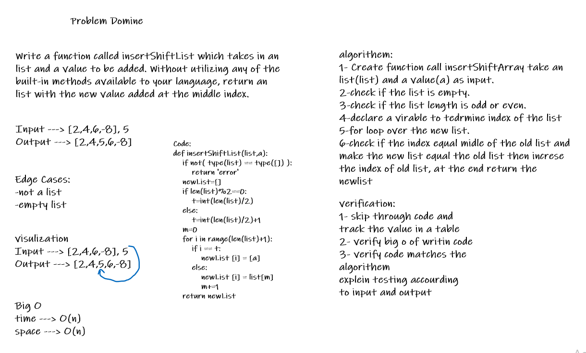

# Insert to Middle of an Array
<!-- Description of the challenge -->
Write a function called insertShiftArray which takes in an array and a value to be added. Without utilizing any of the built-in methods available to your language, return an array with the new value added at the middle index.

## Whiteboard Process
<!-- Embedded whiteboard image -->

## Approach & Efficiency
<!-- What approach did you take? Discuss Why. What is the Big O space/time for this approach? -->
Create function call insertShiftArray take an array(arr) and a value(a) as input,check if the array is empty,then check if the array length is odd or even, then declare a virable to tedrmine index of array,for loop over the new array, then check if the index equal midle of the old array and make the new array equal the old array then increse the index of old array, at the end return the newarray