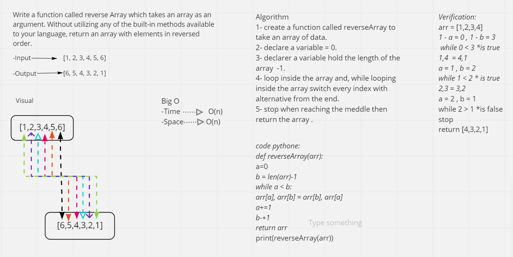

# Insert to Middle of an Array
<!-- Description of the challenge -->
Write a function called reverseArray which takes an array as an argument. Without utilizing any of the built-in methods available to your language, return an array with elements in reversed order.

## Whiteboard Process
<!-- Embedded whiteboard image -->

## Approach & Efficiency
<!-- What approach did you take? Discuss Why. What is the Big O space/time for this approach? -->
Create function call reverseArray take an array as input, Declare variable equal 0, Declare variable hold length of the input array -1 , Loop through the array, while looping For every ietration swap the current index with the alternative from the end, Stop when you reach the middle than return the array.

Big O Time--> O(n)

Big O space--> O(n)